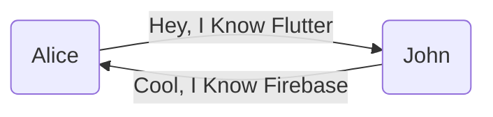

# Why do you need Tech Communities

slides for Hack Club KMEA

  
    GO <carbon:arrow-right class="inline"/>
  

<BarBottom
  title="Akash Santhosh"
  :social="[
    { type: 'ig', username: 'akash._.santhosh' },
    { type: 'tw', username: '_akashsanthosh' },
    { type: 'wb', username: 'aks.one' }
  ]"
/>

---

# What are Tech Communities?

Tech Communities are communities driven by a group of people to help and respect each other. By nature, these communities are also sustainable, intellectually stimulating, and help you grow in your career

- 🛠 **Skills**

- 👩‍💻 **Oppurtunities** 

- 📚‍ **Knowledge**

- 💬 **Interaction**

- 🤹 **Quick Solutions**

- 🕸️ **Building Networks**

 
 

<BarBottom
  title="Akash Santhosh"
  :social="[
    { type: 'ig', username: 'akash._.santhosh' },
    { type: 'tw', username: '_akashsanthosh' },
    { type: 'wb', username: 'aks.one' }
  ]"
/>

---

# Skills
 - Perhaps one of the most beneficial aspects of getting involved on campus is that it offers you the chance to develop and build skills that you wouldn't get to otherwise. Participation and working with others helps you to round out your soft skills.

 - Partaking in college clubs and organizations alongside your academic responsibilities allows you to practice not only discipline, but also time management. This is a handy skill to have in your personal life, and it's one that future employers will be looking for after you graduate.

 - Collaborating to study new lessons, complete assignments and work on projects helps students approach their course content differently. They are better equipped to critically analyse what they are studying and use logic and reasoning to process any new information.

Here!

Apply Skills

<BarBottom
  title="Akash Santhosh"
  :social="[
    { type: 'ig', username: 'akash._.santhosh' },
    { type: 'tw', username: '_akashsanthosh' },
    { type: 'wb', username: 'aks.one' }
  ]"
/>

---

# Information and Knowledge

- Knowledge through many channels such as conversations, meetings, learning sessions, workshops, and webinars.

- Tech communities today are not just about knowledge sharing today. They are abuzz with the latest developments in technology.

- Peer-to-Peer Learning is an important and innovative learning method in the communities.

- Gaining knowledge can foster collective creativity and give birth to innovative ideas or restructure the existing designs.

- When you are able to put your work out there and also create impact, it gives you opportunities to get job offers.

<BarBottom
  title="Akash Santhosh"
  :social="[
    { type: 'ig', username: 'akash._.santhosh' },
    { type: 'tw', username: '_akashsanthosh' },
    { type: 'wb', username: 'aks.one' }
  ]"
/>

---
preload: false
---

#

  

    
    
    
  

  

    Network
  

  - Its the most integral part of being in a community.
  
  - It lets you connect with individuals who might be more experienced in the field.

  - Building relationships that will eventually be beneficial to one’s career life.

  - It can lead to great friendships and get co-workers.

<BarBottom
  title="Akash Santhosh"
  :social="[
    { type: 'ig', username: 'akash._.santhosh' },
    { type: 'tw', username: '_akashsanthosh' },
    { type: 'wb', username: 'aks.one' }
  ]"
/>

---

# What is **Networking** ??
 dont read btw, this is just for a rasam

Many people believe that networking during a job search means calling everyone and asking them for a job. People associate networking with being pushy and overbearing. Some people tend to hide away from networking because they don’t want to be labeled as this type of person. Networking is a two way street, it is a way of getting to know someone better and finding ways they might be able to help you and how you can help them in return.

A professional networking event is a great opportunity to present yourself, make new connections and even find yourself a new job. Current research shows that a large number of jobs are filled through networking. Successful networkers display a sincere interest in their networking contacts and work hard to develop a relationship, establish their credibility and share their information and knowledge. To become a successful networker, you should follow the belief that everyone has something to learn and gain. 

Networking is an ongoing process, it requires persistence, attention, organisation and good will. Incorporate the art of networking into your job search and you will gain opportunities and build relationships that will last a lifetime.

<BarBottom
  title="Akash Santhosh"
  :social="[
    { type: 'ig', username: 'akash._.santhosh' },
    { type: 'tw', username: '_akashsanthosh' },
    { type: 'wb', username: 'aks.one' }
  ]"
/>
---

# How to network

1. Meet People Through Other People

2. Leverage Social Media

3. Don’t Ask For A Job

4. Use Your Resume as a Tool for Advice

5. Don’t Take Up Too Much Time

6. Let The Other Person Speak

7. Find a Reason to Follow Up

8. Online Presence

9. Information/News

10. Mentor/Guiding

11. Never dismiss anyone as unimportant.

<BarBottom
  title="Akash Santhosh"
  :social="[
    { type: 'ig', username: 'akash._.santhosh' },
    { type: 'tw', username: '_akashsanthosh' },
    { type: 'wb', username: 'aks.one' }
  ]"
/>

---
layout: center
class: text-center
---

# Thank You
 
 ## Akash Santhosh 

<BarBottom
  title="Akash Santhosh"
  :social="[
    { type: 'ig', username: 'akash._.santhosh' },
    { type: 'tw', username: '_akashsanthosh' },
    { type: 'wb', username: 'aks.one' }
  ]"
/>
